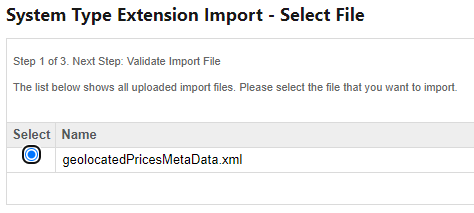
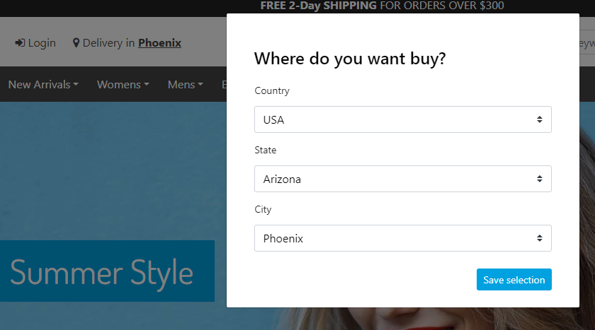
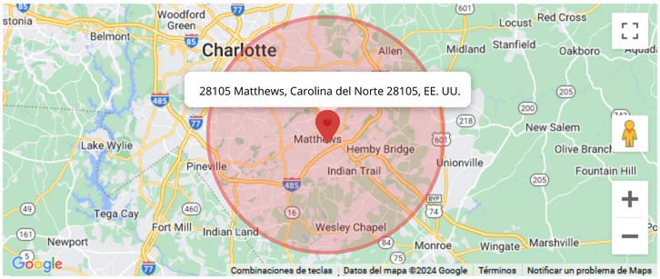
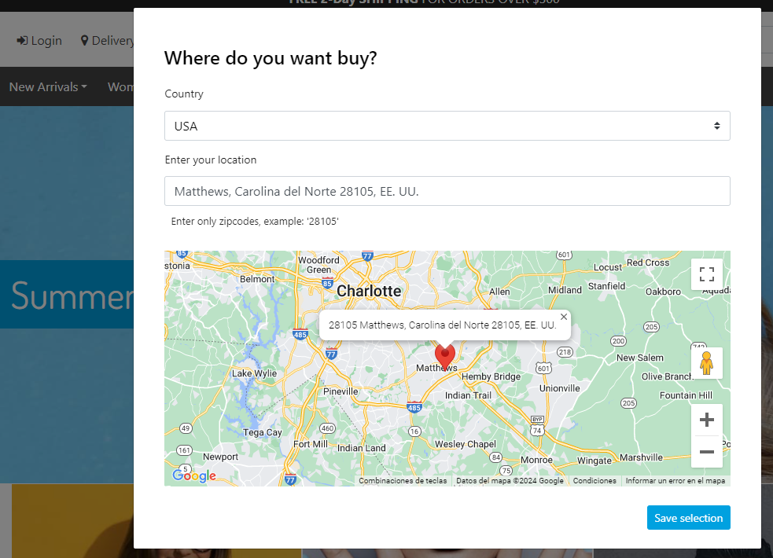

# Salesforce Commerce Cloud (SFCC) Geolocated Pricebooks Plugin

Note: This repository is a preview of the SFCC Geolocated Pricebooks Plugin. The purpose of this repository is to allow future customers to see the file structure of the package and to access the README and see how the package works and what features provides. It is important to mention that Geolocated Pricebooks Plugin for PWA Kit uses **template extensibility** so this preview is only meant to show the file structure and the files that were modified when building the package. File structure and files preview for Geolocated Pricebooks Plugin for SFRA is also available. The complete package contains the full structure of both PWA Kit and SFRA code. 

The files available in this preview are:

- [PWA _app-config](./sfcc-geolocated-pricebooks-plugin/app/components/_app-config/index.jsx)
- [PWA app-core](./sfcc-geolocated-pricebooks-plugin/app/components/app-core/index.jsx)
- [PWA display-price](./sfcc-geolocated-pricebooks-plugin/app/components/display-price/index.jsx)
- [PWA header](./sfcc-geolocated-pricebooks-plugin/app/components/header/index.jsx)
- [PWA product-tile](./sfcc-geolocated-pricebooks-plugin/app/components/product-tile/index.jsx)
- [PWA regions-menu theme](./sfcc-geolocated-pricebooks-plugin/app/theme/components/project/regions-menu.js)
- [PWA global styles](./sfcc-geolocated-pricebooks-plugin/app/theme/foundations/styles.js)
- [PWA index theme](./sfcc-geolocated-pricebooks-plugin/app/theme/index.js)
- [PWA shopper-stores-manager](./sfcc-geolocated-pricebooks-plugin/app/utils/shopper-stores-manager.js)
- [SFRA hooks json](./codebase/geolocated-pricebooks/cartridges/geolocated_pricebooks/hooks.json)
- [SFRA regions](./codebase/geolocated-pricebooks/cartridges/geolocated_pricebooks/cartridge/client/default/js/regions.js)
- [SFRA geopricingstyles](./codebase/geolocated-pricebooks/cartridges/geolocated_pricebooks/cartridge/client/default/scss/geopricingstyles.scss)
- [SFRA RenderOption](./codebase/geolocated-pricebooks/cartridges/geolocated_pricebooks/cartridge/client/default/js/components/helpers/RenderOption.js)
- [SFRA regionsModal](./codebase/geolocated-pricebooks/cartridges/geolocated_pricebooks/cartridge/client/default/js/components/regionsModal.js)
- [SFRA countries json](./codebase/geolocated-pricebooks/cartridges/geolocated_pricebooks/cartridge/config/countries.json)
- [SFRA modalSelectionLocation properties](./codebase/geolocated-pricebooks/cartridges/geolocated_pricebooks/cartridge/templates/resources/modalSelectLocation.properties)

Geolocated Pricebooks Plugin for Salesforce Commerce Cloud (SFCC) is a comprehensive package that adds essential functionalities for e-commerce. This plugin allows you to establish and manage geolocated prices by store or region, which is particularly useful for businesses adjusting prices based on location.

Moreover, this package can seamlessly integrate with Salesforce Commerce Cloud architectures like Storefront Reference Architecture (SFRA) or PWA Kit | Composable Storefront. This flexibility ensures a customizable implementation, adapting to the specific needs of each e-commerce business.

# Features 

SFCC Geolocated Pricebooks Plugin provides the following features:

- Update prices and currency of the site based on geolocated regions
- Two main configuration modes: Prices by Region and Prices by Store
- Configure and customize a list of geolocated regions for the e-commerce site
- Integration with Google Maps for Prices by Store mode
- Persistence of the geolocated region selected by the customer

### Configuration modes:

**Prices by Region:** 
    The ability to set prices by region allows defining prices at up to four regional levels, enabling more precise selection for each specific region. This functionality provides greater adaptability to the local environment, allowing precise adjustments aligned with the needs of each location.

**Prices by Store:**
    Facilitates the definition of a more precise location by using the Stores functionality included in Salesforce Commerce Cloud and by integrating Google Maps features, allowing customers to select their location more accurately and thus, making precise price and currency adjustments aligned with needs of each location.

# Prerequisites

**1.** The store must be previously configured and functioning correctly under the SFRA or PWA kit Architecture.

**2.** You must have **Administrator** permissions in the Business Manager (BM), which will allow you to configure the package.

**3.** The extended **Prices by Store** functionality requires a Google Maps API-KEY, which must have permissions on the following APIs ( Google Places API, Google Geocoder API)

> [!NOTE]
> If you want to use the **Prices by Store** mode, it is essential to have a Google Maps API-KEY to ensure that it works correctly.

# Installation

### Storefront Reference Architecture (SFRA)

The Geolocated Pricebooks Plugin for Salesforce Commerce Cloud (SFCC) is designed to integrate with Storefront Reference Architecture (SFRA). To install this package, please follow the instructions in the [installation guide for SFRA](./codebase/geolocated-pricebooks/README.md)

### PWA kit

The Geolocated Pricebooks Plugin for Salesforce Commerce Cloud (SFCC) is designed to integrate with PWA Kit. To install this package, please follow the instructions in the [installation guide for PWA Kit](./sfcc-geolocated-pricebooks-plugin/README.md)

# Set up & Usage:

### SFRA (Storefront Reference Architecture) or PWA kit | Composable Storefront

When entering the Business Manager (BM) with administrator permissions, proceed to perform the following steps to correctly configure the required package fields.

> [!IMPORTANT]
> You can also download an [XML](./codebase/geolocated-pricebooks/docs/geolocatedPricesMetaData.xml) file that defines the necessary fields and groups fot the package configuration. 
> Once you have downloaded the XML file continue from step **7**.

1. Go to the **Administration** option > **Site Development** column > **System Object Types**.
2. Once inside **System Object Types**, access the **SitePrerences** option.
3. After entering the **SitePrerences** option,  go to the **Attribute Definitions** tab.
4. In this section create the necessary fields for the package functionality by clicking on **New**.

    - (Available Countries) Specifications:
        - ID: **GeolocatedPricesAvailableCountries**
        - Display Name **example**: Available Countries
        - Value Type: Enum of Strings
        - Select Multiple: Checked
        - Mandatory: Checked

    - (Regions JSON) Specifications:
        - ID: **GeolocatedPricesRegionsJson**
        - Display Name **example**: Regions 
        - Value Type: Text
        - Mandatory: Checked
    
    - (Pricebook Selection Type) Specifications:
        - ID: **GeolocatedPricesPriceBookSelectionType**
        - Display Name **example**: Pricebook Type
        - Value Type: Enum of Strings
        - Mandatory: Checked
        - Selection Attributes: 
            - value: byregion, Display value **example**: Precios by Region
            - value: bystore, Display value **example**: Prices by Store

> [!NOTE]
> Make sure that the properties for the new attributes are created exactly as they appear in this documentation

> [!NOTE]
> The previous configuration is crucial for the **Prices by Region** mode. The next point is optional, proceed to point 6 if necessary

5. If you meet the [prerequisites](#prerequisites) for extended functionality with Google Maps, you should perform the following configurations for **Prices by Store** mode:

    - (Key Google Maps) Specifications:
        - ID: **GeolocatedPricesKeyGoogleMaps**
        - Display Name **example**: Key Google Maps
        - Value Type: String
    
    - (Maximun Distance) Specifications:
        - ID: **GeolocatedPricesMaxDistance**
        - Display Name **example**: Maximun Distance
        - Value Type: Number

    - (Distance Units By Store) Specifications:
        - ID: **GeolocatedPricesDistanceUnits**
        - Display Name **example**: Distance Units By Store
        - Value Type: Enum of Strings
        - Selection Attributes:
            - value: km, Display value **example**: Killometers
            - value: ml, Display value **example**: Miles
    
    -  (Show or Hide Map) Specifications:
        - ID: **GeolocatedPricesShowMap**
        - Display Name **example**: Show or Hide Map
        - Value Type: **Boolean**
        - Default value: No (**false**)
    
    -  (Only Zipcodes) Specifications:
        - ID: **GeolocatedPricesOnlyZipcodes**
        - Display Name **example**: Only Zipcodes
        - Value Type: **Boolean**
        - Default value: No (**false**)

6. After configuring the necessary package fields, proceed to create a group for these fields, and then configure this group in the **Attribute Grouping** tab.

    - New Attribute Group:
        - ID **example**: GeolocatedPricebooksConfig, Name **example**: Geolocated Pricebooks Configurations.
        - Click on **Add**.
        - After creating the group, click on the **edit** option.
        - Then click on the **...** option, which is located to the right of the **ID** field.
        - At this point, a new window opens where you must select all the fields of the **example** configuration. If you only configure the **Prices by Region** fields, you should only  select those fields and click **Select**. If you configure all the fields, you should select them and click **Select**.

> [!NOTE]
> Remember that you can download an [XML](./codebase/geolocated-pricebooks/docs/geolocatedPricesMetaData.xml) file that defines the necessary fields and groups for the package operation.

> [!NOTE]
> If you made the configurations manually, you can skip the points from 7 to 12

7. Go to the **Administration** option > **Site Development** column > **Import & Export**
8. Locate the **Import & Export files** section and click the **Upload** option
9. While in the new section choose and upload the provided [XML](./codebase/geolocated-pricebooks/docs/geolocatedPricesMetaData.xml) file
10. After uploading the file, you should be able to see it in the table under the **Manage Import Files** section
11. Return to **Import & Export** column and locate the **Meta Data** section and click on the **Import** option.
12. You should see the file uploaded previously in a table under the **System Type Extension Import - Select File** section, select it and then, click the **Next** button.



> [!NOTE]
> In case you found any error logs during the import process, we recommend contacting the Appspring Technologies team for assistance and to resolve any.

> [!TIP]
> If necessary, proceed with the manual configuration of the procedure by performing the process from point 1 to point 6.

14. After clicking the **Next** button, proceed by clicking **Import**.
15. If the import is  successful, you can review the import status and/or verify that the fields have been created correctly. To do this, review points 1, 2 and 3 of this section, where you will find the fields defined according to the XML file. If you also want to verify that the group was created correctly, you can do so by following step 6. 

### Set up information for regions:

After creating and grouping the fields, proceed to configure the region data.

1. You must go to the **Merchant Tools** option > **Site Preferences** > **Custom Preferences** column.

2. Then you must enter the previously created group which in this case is called *GeolocatedPricebooksConfig*

3. In this section, you should see the previously created fields.

>[!WARNING]
> If you do not see the fields associated with the group, make sure to complete point 6 of the field configuration correctly.

> Fields marked with **(*)** are mandatory for the package to function.

4. In the **Regions JSON** field you must enter a regions object, that  contains the necessary information for the countries. For example:

```
    {"id":"global","displayName":"Global","type":"Country","regions":"id":"US":"USA","type":"State","regions":[{"id":"alabama","displayName":"Alabama","type":"City","regions":[{"id":"montgomery","displayName":"Montgomery","pricebookID":"list-prices-montgomery"}]}]}
```
    
5. The plugin provides a predefined regions JSON, which can be found [here](./codebase/geolocated-pricebooks/docs/regions.json)

6. Now you must configure the **Available Countries** field. To do this, you must go back to the field configuration and select the **Available Countries** attribute.

>[!NOTE]
> If you don´t remember how to access the field configurations, you can review the first three steps of [Setup](#set-up--usage) section.

7. Once you have entered the **Available Countries** attribute, you must create a list of countries where your stores will be available.

- **Example:**
    - **Value**: US, **Display Value**: United States
    - **Value**: MX, **Display Value**: México
    - **Value**: CO, **Display Value**: Colombia

> This configuration will be available for both configuration modes **Prices by Region** and **Prices by Store**.

8. In the **priceBookSelectionType** field, you must select the **byregion** or **bystore** option, if you do not have the necessary data for the **Prices by Store** configuration, you should select the **byregion** option.

> Once the configuration is complete, you should see the following result in your store (**Prices by Region**):


9. If the store is configured by **bystore** you must consider the following configuration parameters:

- In the **Key Google Maps** field of type **string** you must enter the ***API_KEY*** provided by Google Maps.
- In the **Maximun Distance** field you must enter the maximum distance of the search radius. if you do not select a parameter for this field, the package defaults to a distance of'**15**' kilometers or miles.

> The search radius is important to determine the nearest store and to establish store prices.


- In the **Distance Units By Store** field you must select the distance units for the search radius, either '**kilometers**' or '**miles**', if you do not select a parameter for this field, the package will default to distance units in '**kilometers**'.

10. After configuring the API_KEY, the maximum distance, the distance units, you will find two additional configuration options.

- In the **Show or Hide Map** field of type **Bolean** you can determine, whether the Google Maps map will be displayed on the Storefront or not.
- In the **Only Zipcodes** field of type **Bolean** you can restrict the search to zipcodes only. Here, the user should enter only the postal code, to get the desired location.

> Once the configuration is complete, you should see the following result in your store (**Prices per Store**):


> [!IMPORTANT]
> If your configuration is: **Prices per Store (bystore)**, remember to set a Pricebook ID, Latitude and Longitude for each store. You can do this as follows:
> 1. Go to  **Merchant Tools** > **Online Marketing** >**Stores** column.
> 2. Select a store. Once you enter the store description, navigate to the **ADDRESS** tab, where you will enter the latitude and longitude of the store. You can obtain  these coordinates  with the help of [Google Maps](https://www.google.com/maps).
> 3. Then navigate to the **GEOLOCATED PRICES** tab and in the **Pricebook Id** field enter the pricebookId that will be associated to the merchant.